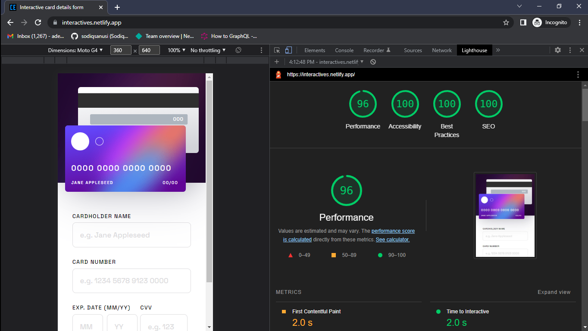

# Interactive Card Creator

## Table of contents

- [Overview](#overview)
  - [The challenge](#the-challenge)
  - [Screenshot](#screenshot)
  - [Links](#links)
- [My process](#my-process)
  - [Built with](#built-with)
  - [What I learned](#what-i-learned)
  - [Continued development](#continued-development)
  - [Useful resources](#useful-resources)
- [Author](#author)
- [Acknowledgments](#acknowledgments)

## Overview
The goal was to build an application that allows a user to input details of an imaginary debit card. The app then shows the user a snapshot of the debit card after validating the details inputted.

### The challenge
Users should be able to:

- Fill in the form and see the card details update in real-time
- Receive error messages when the form is submitted if:
  - Any input field is empty
  - The card number, expiry date, or CVV fields are in the wrong format
- View the optimal layout depending on their device's screen size
- See hover, active, and focus states for interactive elements on the page

### Screenshot

### Links
- Solution URL: [https://github.com/sodiqsanusi/interactive-card/](https://github.com/sodiqsanusi/interactive-card/)
- Live Site URL: [https://interactives.netlify.app/](https://interactives.netlify.app/)

## My process
Heyy👋🏾👋🏾. First off, before starting this project I thought I wouldn't be able to get it done in the time I estimated for myself (2 days). Funny stuff is that I actually got it done before the end of the second day. Anyways, started out by sketching out the map of how the site will be structured, then moved on to converting the sketched out map into an HTML file. Mobile-first workflow for the styling, where I decided to use SCSS to just play around with things. I did all these in the first day. The next day was for implementing the functionalities with Javascript. That's all I guess.  

### Built with
- SCSS.
- Mobile-first workflow.
- Flexbox.

### What I learned
Do you know an `input` HTML tag can't display either an `::after` or `::before` pseudo-element? Well, this is because it is a replaced element. I'll drop a link that talks about that in the [useful resources](#useful-resources) section.   

### Continued development
Uhmm, at this point, I'm getting a bit bored of just creating side personal projects and stuff. So I'll probably consider looking for internships or early career opportunites for frontend developers soon.

> Can you believe that I haven't made my portfolio yet🥺😭?

### Useful resources
- [Replacable HTML elements - @kentaro_au](https://weekendprojects.dev/posts/css-after-not-working/) - I promised to share the link here. It's a quick read by the way.
- [Chasing the pixel-perfect Dream - Josh Comeau](https://www.joshwcomeau.com/css/pixel-perfection/) - This was very enlightening and interesting to read, a recommend for any frontend developer (and designers too!)
## Author
- Twitter - [@sodiqsanusi0](https://www.twitter.com/sodiqsanusi0)
- LinkedIn - [Sodiq Sanusi](https://www.linkedin.com/in/sodiqsanusi0)

## Acknowledgments
As usual, the FrontendMentor team👏🏾.
